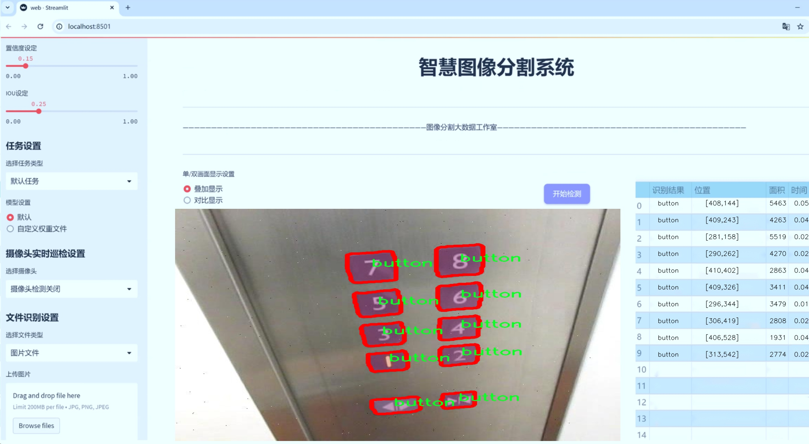
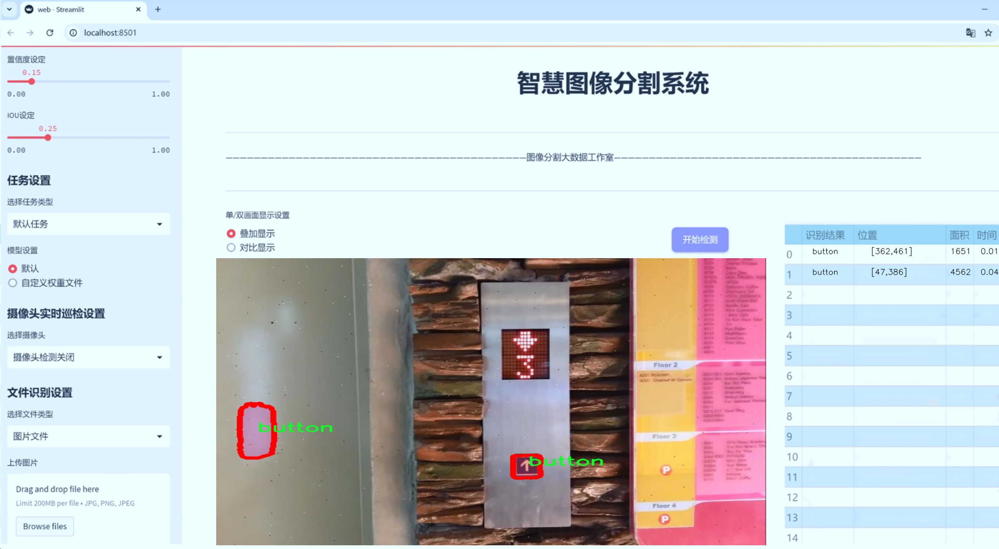
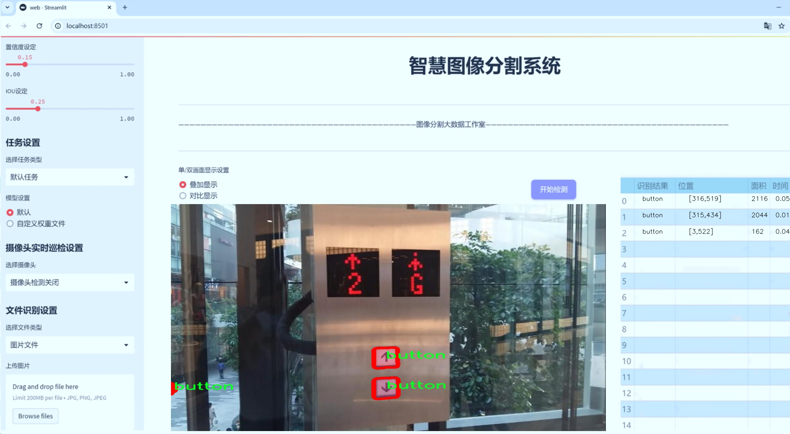
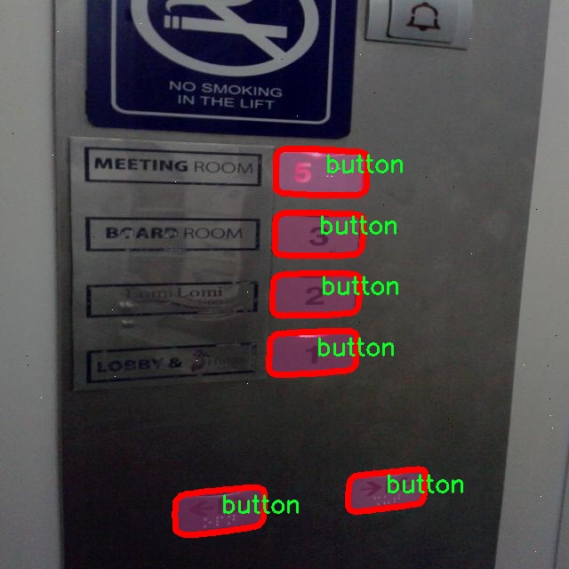
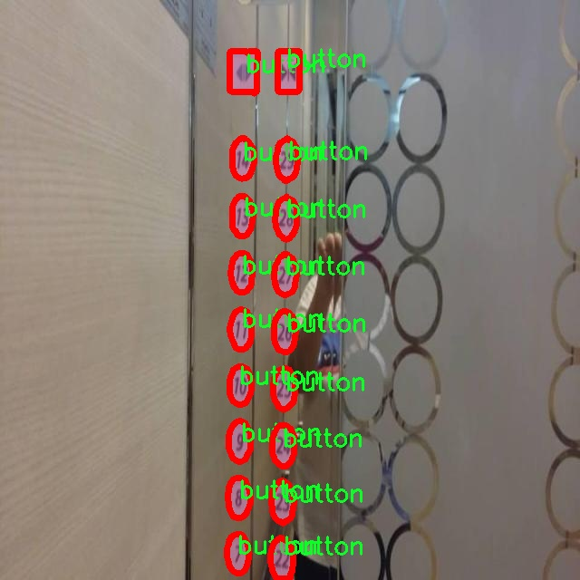
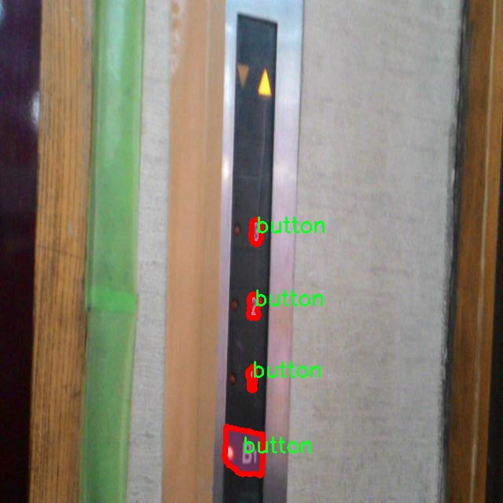
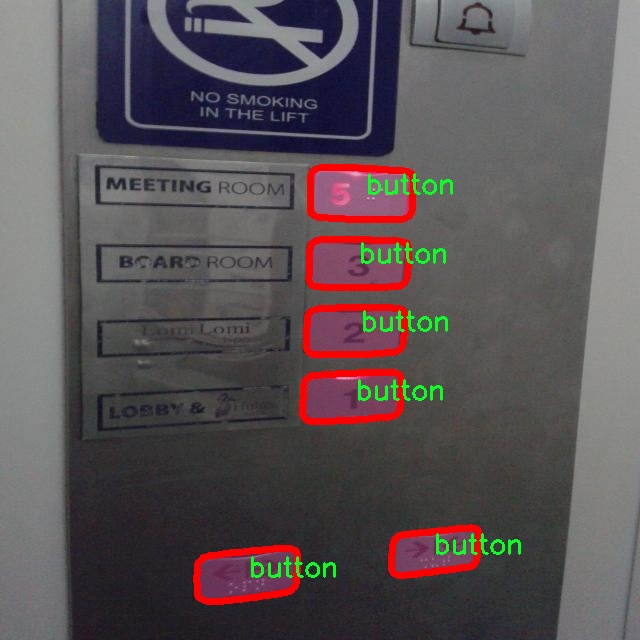
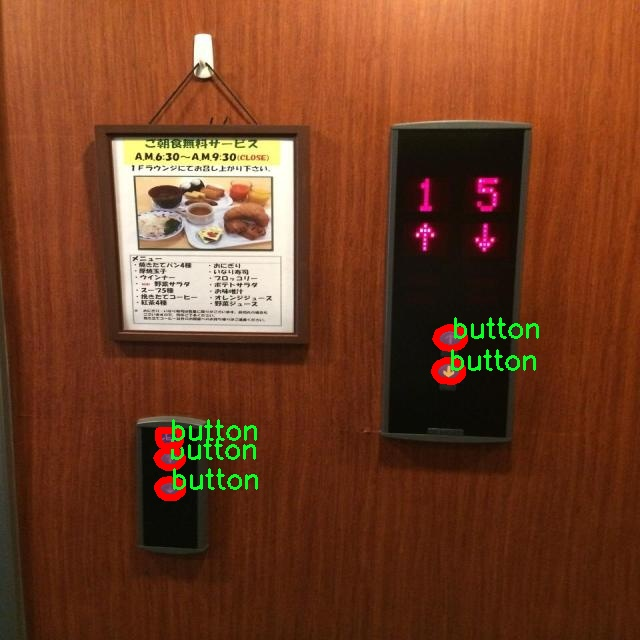

# 按钮图像分割系统源码＆数据集分享
 [yolov8-seg-C2f-DiverseBranchBlock＆yolov8-seg-fasternet等50+全套改进创新点发刊_一键训练教程_Web前端展示]

### 1.研究背景与意义

项目参考[ILSVRC ImageNet Large Scale Visual Recognition Challenge](https://gitee.com/YOLOv8_YOLOv11_Segmentation_Studio/projects)

项目来源[AAAI Global Al lnnovation Contest](https://kdocs.cn/l/cszuIiCKVNis)

研究背景与意义

随着人工智能技术的迅猛发展，计算机视觉领域的研究不断深入，尤其是在图像分割和目标检测方面，取得了显著的进展。YOLO（You Only Look Once）系列模型因其高效的实时性和准确性，成为了目标检测领域的热门选择。YOLOv8作为该系列的最新版本，进一步提升了检测精度和速度，尤其在复杂场景下的表现愈加出色。然而，针对特定目标的实例分割任务，尤其是对于按钮这一类相对简单但在用户界面设计和人机交互中极为重要的元素，现有的YOLOv8模型仍然存在一定的局限性。因此，基于改进YOLOv8的按钮图像分割系统的研究显得尤为重要。

本研究的主要数据集包含1900张图像，专注于按钮这一单一类别，提供了一个相对集中的研究环境。按钮作为用户界面中的重要组成部分，其形状、颜色、大小和位置的多样性使得图像分割任务具有一定的挑战性。通过对这一特定类别的深入研究，不仅可以提升YOLOv8在实例分割任务中的表现，还能为实际应用提供更加精准的解决方案。按钮的精确分割将直接影响到后续的用户体验和界面设计，因此，研究其图像分割的有效性具有重要的实际意义。

在技术层面，改进YOLOv8的按钮图像分割系统将结合深度学习中的多种技术手段，例如数据增强、特征提取优化和后处理算法的改进，以提升模型在特定任务中的性能。通过对现有模型的改进和优化，旨在实现更高的分割精度和更快的处理速度，从而满足实时应用的需求。此外，研究过程中将探索如何有效地利用1900张图像的数据集，提升模型的泛化能力和鲁棒性，以应对不同场景下的按钮图像分割任务。

从学术研究的角度来看，本研究不仅有助于推动YOLOv8在实例分割领域的应用研究，也为后续的相关研究提供了理论基础和实践经验。通过对按钮图像分割的深入分析，研究将揭示深度学习模型在特定任务中的适用性和局限性，为后续的研究提供参考。同时，本研究也将为人机交互、用户界面设计等领域提供有价值的技术支持，促进相关行业的技术进步。

综上所述，基于改进YOLOv8的按钮图像分割系统的研究，不仅具有重要的理论意义，也具备广泛的应用前景。通过深入探讨按钮图像分割的相关技术和方法，研究将为计算机视觉领域的进一步发展提供新的思路和方向，推动相关技术的实际应用，为用户界面的智能化和人机交互的优化贡献力量。

### 2.图片演示







##### 注意：由于此博客编辑较早，上面“2.图片演示”和“3.视频演示”展示的系统图片或者视频可能为老版本，新版本在老版本的基础上升级如下：（实际效果以升级的新版本为准）

  （1）适配了YOLOV8的“目标检测”模型和“实例分割”模型，通过加载相应的权重（.pt）文件即可自适应加载模型。

  （2）支持“图片识别”、“视频识别”、“摄像头实时识别”三种识别模式。

  （3）支持“图片识别”、“视频识别”、“摄像头实时识别”三种识别结果保存导出，解决手动导出（容易卡顿出现爆内存）存在的问题，识别完自动保存结果并导出到tempDir中。

  （4）支持Web前端系统中的标题、背景图等自定义修改，后面提供修改教程。

  另外本项目提供训练的数据集和训练教程,暂不提供权重文件（best.pt）,需要您按照教程进行训练后实现图片演示和Web前端界面演示的效果。

### 3.视频演示

[3.1 视频演示](https://www.bilibili.com/video/BV1PAmiYeEdR/)

### 4.数据集信息展示

##### 4.1 本项目数据集详细数据（类别数＆类别名）

nc: 1
names: ['button']


##### 4.2 本项目数据集信息介绍

数据集信息展示

在本研究中，我们使用了名为“button”的数据集，旨在改进YOLOv8-seg的按钮图像分割系统。该数据集专注于单一类别的图像数据，类别数量为1，具体类别为“button”。这一简化的类别设置使得我们能够集中精力在按钮图像的特征提取和分割任务上，从而提升模型在特定应用场景下的性能。

“button”数据集包含了多种不同类型的按钮图像，这些图像来源于多个实际应用场景，涵盖了不同的形状、颜色和尺寸。这种多样性确保了模型在面对各种按钮时的鲁棒性和适应性。数据集中不仅包含了标准的圆形和方形按钮，还包括了更复杂的设计，如带有图标的按钮和透明背景的按钮图像。这种丰富的图像内容为模型的训练提供了充足的样本，使其能够学习到按钮的多样性特征。

在数据预处理阶段，我们对“button”数据集进行了严格的筛选和标注，以确保每张图像的质量和准确性。每个按钮图像都经过精确的分割标注，确保模型在训练过程中能够准确地学习到按钮的边界和形状特征。通过这种方式，我们能够有效地减少模型在推理时的误差，提高分割的精度。

为了进一步增强模型的泛化能力，我们在数据集中应用了多种数据增强技术。这些技术包括随机旋转、缩放、翻转以及颜色变换等，使得模型能够在训练过程中接触到更多样化的图像变体。这种策略不仅提高了模型的鲁棒性，还帮助其更好地适应不同的光照条件和背景环境。

在训练过程中，我们采用了YOLOv8-seg这一先进的深度学习框架。该框架结合了目标检测和图像分割的优点，能够在同一模型中实现高效的分割和定位。通过使用“button”数据集，我们对YOLOv8-seg进行了针对性的调整和优化，以适应按钮图像的特征。我们在训练过程中不断监控模型的性能，通过验证集的反馈不断调整超参数，确保模型在分割任务中的表现达到最佳。

最终，我们的目标是通过对“button”数据集的深入挖掘和分析，构建一个高效的按钮图像分割系统。该系统不仅能够在工业自动化、用户界面设计等领域发挥重要作用，还能够为未来的相关研究提供基础数据支持。通过这一研究，我们希望能够推动按钮图像分割技术的发展，为实际应用提供更为精确和高效的解决方案。











### 5.全套项目环境部署视频教程（零基础手把手教学）

[5.1 环境部署教程链接（零基础手把手教学）](https://www.bilibili.com/video/BV1jG4Ve4E9t/?vd_source=bc9aec86d164b67a7004b996143742dc)


[5.2 安装Python虚拟环境创建和依赖库安装视频教程链接（零基础手把手教学）](https://www.bilibili.com/video/BV1nA4VeYEze/?vd_source=bc9aec86d164b67a7004b996143742dc)

### 6.手把手YOLOV8-seg训练视频教程（零基础小白有手就能学会）

[6.1 手把手YOLOV8-seg训练视频教程（零基础小白有手就能学会）](https://www.bilibili.com/video/BV1cA4VeYETe/?vd_source=bc9aec86d164b67a7004b996143742dc)


按照上面的训练视频教程链接加载项目提供的数据集，运行train.py即可开始训练



     Epoch   gpu_mem       box       obj       cls    labels  img_size
     1/200     0G   0.01576   0.01955  0.007536        22      1280: 100%|██████████| 849/849 [14:42<00:00,  1.04s/it]
               Class     Images     Labels          P          R     mAP@.5 mAP@.5:.95: 100%|██████████| 213/213 [01:14<00:00,  2.87it/s]
                 all       3395      17314      0.994      0.957      0.0957      0.0843

     Epoch   gpu_mem       box       obj       cls    labels  img_size
     2/200     0G   0.01578   0.01923  0.007006        22      1280: 100%|██████████| 849/849 [14:44<00:00,  1.04s/it]
               Class     Images     Labels          P          R     mAP@.5 mAP@.5:.95: 100%|██████████| 213/213 [01:12<00:00,  2.95it/s]
                 all       3395      17314      0.996      0.956      0.0957      0.0845

     Epoch   gpu_mem       box       obj       cls    labels  img_size
     3/200     0G   0.01561    0.0191  0.006895        27      1280: 100%|██████████| 849/849 [10:56<00:00,  1.29it/s]
               Class     Images     Labels          P          R     mAP@.5 mAP@.5:.95: 100%|███████   | 187/213 [00:52<00:00,  4.04it/s]
                 all       3395      17314      0.996      0.957      0.0957      0.0845


### 7.50+种全套YOLOV8-seg创新点代码加载调参视频教程（一键加载写好的改进模型的配置文件）

[7.1 50+种全套YOLOV8-seg创新点代码加载调参视频教程（一键加载写好的改进模型的配置文件）](https://www.bilibili.com/video/BV1Hw4VePEXv/?vd_source=bc9aec86d164b67a7004b996143742dc)

### 8.YOLOV8-seg图像分割算法原理

原始YOLOv8-seg算法原理

YOLOv8-seg算法是YOLO系列目标检测算法的最新进展，结合了目标检测与图像分割的能力，旨在提供更高效、更精确的图像理解解决方案。作为一种单阶段检测算法，YOLOv8在前几个版本的基础上进行了多项优化，尤其是在精度和速度方面的显著提升，使其在各种应用场景中表现出色。YOLOv8-seg不仅保留了YOLO系列一贯的高效性，还通过改进的网络结构和算法设计，增强了对复杂场景的处理能力。

YOLOv8-seg的网络结构由四个主要部分组成：输入层、Backbone骨干网络、Neck特征融合网络和Head检测模块。输入层负责对图像进行预处理，包括调整图像比例、实现Mosaic增强以及计算瞄点。这一过程不仅提高了模型的鲁棒性，还有效地增强了训练样本的多样性。Mosaic增强技术通过将多张图像随机缩放并拼接，迫使模型学习不同位置和背景下的目标特征，从而提高了预测精度。

在Backbone部分，YOLOv8采用了C2F模块替代了传统的C3模块，这一设计灵感来源于YOLOv7中的ELAN模块。C2F模块通过并行化更多的梯度流分支，能够在保持轻量化的同时，获取更丰富的特征信息。这种结构的改进使得YOLOv8在特征提取过程中，能够更有效地捕捉到不同尺度目标的细节，进而提升了检测精度。

Neck部分则采用了双塔结构，将特征金字塔网络（FPN）与路径聚合网络（PAN）相结合，进一步增强了语义特征与定位特征的融合能力。这种设计使得网络能够在不同尺度上有效地整合特征信息，确保在处理多样化目标时，模型能够保持高效的特征传递和融合。特征金字塔的引入，使得YOLOv8在面对不同大小的目标时，能够灵活应对，提升了检测的准确性和召回率。

Head模块是YOLOv8-seg算法的核心部分，其结构的变化尤为显著。YOLOv8从传统的耦合头（Coupled-Head）转变为解耦头（Decoupled-Head），将检测和分类的任务分开处理。这一设计不仅加速了模型的收敛速度，还提高了预测的准确性。在损失函数的设计上，YOLOv8采用了DFL（Distribution Focal Loss）与CIoU（Complete Intersection over Union）相结合的方式，旨在快速聚焦于标签附近的数值，提升模型对目标位置的敏感性。

值得注意的是，YOLOv8-seg在目标检测的基础上，进一步扩展了图像分割的能力。通过引入分割头，YOLOv8-seg能够在检测目标的同时，对目标进行精确的像素级分割。这一特性使得YOLOv8-seg在需要高精度分割的应用场景中，表现出色，如医学图像分析、自动驾驶等领域。

在YOLOv8-seg的训练过程中，模型采用了自适应图片缩放的策略，以提高推理速度。具体而言，模型在推理时将图像的长边按比例缩小到指定尺寸，然后对短边进行填充，这种方法有效减少了信息冗余，提升了检测效率。此外，YOLOv8-seg还在训练阶段采用了Mosaic增强操作，以进一步提升模型的泛化能力。

YOLOv8-seg的轻量化设计也是其一大亮点。通过对网络结构的优化，YOLOv8-seg能够在保持高性能的同时，显著降低计算复杂度。这一特性使得YOLOv8-seg在资源受限的环境中，依然能够高效运行，满足实时检测的需求。

综上所述，YOLOv8-seg算法通过一系列创新的设计和优化，成功地将目标检测与图像分割相结合，提供了一种高效、精确的解决方案。其独特的网络结构、先进的特征融合技术以及灵活的训练策略，使得YOLOv8-seg在多种应用场景中展现出强大的能力，成为当前计算机视觉领域的重要工具。随着技术的不断进步，YOLOv8-seg有望在更广泛的领域中发挥作用，推动智能视觉技术的发展。


### 9.系统功能展示（检测对象为举例，实际内容以本项目数据集为准）

图9.1.系统支持检测结果表格显示

  图9.2.系统支持置信度和IOU阈值手动调节

  图9.3.系统支持自定义加载权重文件best.pt(需要你通过步骤5中训练获得)

  图9.4.系统支持摄像头实时识别

  图9.5.系统支持图片识别

  图9.6.系统支持视频识别

  图9.7.系统支持识别结果文件自动保存

  图9.8.系统支持Excel导出检测结果数据


### 10.50+种全套YOLOV8-seg创新点原理讲解（非科班也可以轻松写刊发刊，V11版本正在科研待更新）

#### 10.1 由于篇幅限制，每个创新点的具体原理讲解就不一一展开，具体见下列网址中的创新点对应子项目的技术原理博客网址【Blog】：


[10.1 50+种全套YOLOV8-seg创新点原理讲解链接](https://gitee.com/qunmasj/good)

#### 10.2 部分改进模块原理讲解(完整的改进原理见上图和技术博客链接)【如果此小节的图加载失败可以通过CSDN或者Github搜索该博客的标题访问原始博客，原始博客图片显示正常】
### YOLOv8简介
#### Neck模块设计
骨干网络和 Neck 的具体变化为：

第一个卷积层的 kernel 从 6x6 变成了 3x3
所有的 C3 模块换成 C2f，结构如下所示，可以发现多了更多的跳层连接和额外的 Split 操作


去掉了 Neck 模块中的 2 个卷积连接层
Backbone 中 C2f 的 block 数从 3-6-9-3 改成了 3-6-6-3
查看 N/S/M/L/X 等不同大小模型，可以发现 N/S 和 L/X 两组模型只是改了缩放系数，但是 S/M/L 等骨干网络的通道数设置不一样，没有遵循同一套缩放系数。如此设计的原因应该是同一套缩放系数下的通道设置不是最优设计，YOLOv7 网络设计时也没有遵循一套缩放系数作用于所有模型。

#### Head模块设计
Head 部分变化最大，从原先的耦合头变成了解耦头，并且从 YOLOv5 的 Anchor-Based 变成了 Anchor-Free。其结构如下所示：


可以看出，不再有之前的 objectness 分支，只有解耦的分类和回归分支，并且其回归分支使用了 Distribution Focal Loss 中提出的积分形式表示法。

#### Loss 计算
Loss 计算过程包括 2 个部分： 正负样本分配策略和 Loss 计算。 现代目标检测器大部分都会在正负样本分配策略上面做文章，典型的如 YOLOX 的 simOTA、TOOD 的 TaskAlignedAssigner 和 RTMDet 的 DynamicSoftLabelAssigner，这类 Assigner 大都是动态分配策略，而 YOLOv5 采用的依然是静态分配策略。考虑到动态分配策略的优异性，YOLOv8 算法中则直接引用了 TOOD 的 TaskAlignedAssigner。 TaskAlignedAssigner 的匹配策略简单总结为： 根据分类与回归的分数加权的分数选择正样本。

s 是标注类别对应的预测分值，u 是预测框和 gt 框的 iou，两者相乘就可以衡量对齐程度。

对于每一个 GT，对所有的预测框基于 GT 类别对应分类分数，预测框与 GT 的 IoU 的加权得到一个关联分类以及回归的对齐分数 alignment_metrics 。
对于每一个 GT，直接基于 alignment_metrics 对齐分数选取 topK 大的作为正样本
Loss 计算包括 2 个分支： 分类和回归分支，没有了之前的 objectness 分支。
分类分支依然采用 BCE Loss
回归分支需要和 Distribution Focal Loss 中提出的积分形式表示法绑定，因此使用了 Distribution Focal Loss， 同时还使用了 CIoU Loss
Loss 采用一定权重比例加权即可。
#### 训练数据增强
数据增强方面和 YOLOv5 差距不大，只不过引入了 YOLOX 中提出的最后 10 个 epoch 关闭 Mosaic 的操作。假设训练 epoch 是 500，其示意图如下所示：

### RCS-OSA的基本原理
参考该博客，RCSOSA（RCS-One-Shot Aggregation）是RCS-YOLO中提出的一种结构，我们可以将主要原理概括如下：

1. RCS（Reparameterized Convolution based on channel Shuffle）: 结合了通道混洗，通过重参数化卷积来增强网络的特征提取能力。

2. RCS模块: 在训练阶段，利用多分支结构学习丰富的特征表示；在推理阶段，通过结构化重参数化简化为单一分支，减少内存消耗。

3. OSA（One-Shot Aggregation）: 一次性聚合多个特征级联，减少网络计算负担，提高计算效率。

4. 特征级联: RCS-OSA模块通过堆叠RCS，确保特征的复用并加强不同层之间的信息流动。

#### RCS
RCS（基于通道Shuffle的重参数化卷积）是RCS-YOLO的核心组成部分，旨在训练阶段通过多分支结构学习丰富的特征信息，并在推理阶段通过简化为单分支结构来减少内存消耗，实现快速推理。此外，RCS利用通道分割和通道Shuffle操作来降低计算复杂性，同时保持通道间的信息交换，这样在推理阶段相比普通的3×3卷积可以减少一半的计算复杂度。通过结构重参数化，RCS能够在训练阶段从输入特征中学习深层表示，并在推理阶段实现快速推理，同时减少内存消耗。

#### RCS模块
RCS（基于通道Shuffle的重参数化卷积）模块中，结构在训练阶段使用多个分支，包括1x1和3x3的卷积，以及一个直接的连接（Identity），用于学习丰富的特征表示。在推理阶段，结构被重参数化成一个单一的3x3卷积，以减少计算复杂性和内存消耗，同时保持训练阶段学到的特征表达能力。这与RCS的设计理念紧密相连，即在不牺牲性能的情况下提高计算效率。


上图为大家展示了RCS的结构，分为训练阶段（a部分）和推理阶段（b部分）。在训练阶段，输入通过通道分割，一部分输入经过RepVGG块，另一部分保持不变。然后通过1x1卷积和3x3卷积处理RepVGG块的输出，与另一部分输入进行通道Shuffle和连接。在推理阶段，原来的多分支结构被简化为一个单一的3x3 RepConv块。这种设计允许在训练时学习复杂特征，在推理时减少计算复杂度。黑色边框的矩形代表特定的模块操作，渐变色的矩形代表张量的特定特征，矩形的宽度代表张量的通道数。 

#### OSA
OSA（One-Shot Aggregation）是一个关键的模块，旨在提高网络在处理密集连接时的效率。OSA模块通过表示具有多个感受野的多样化特征，并在最后的特征映射中仅聚合一次所有特征，从而克服了DenseNet中密集连接的低效率问题。

OSA模块的使用有两个主要目的：

1. 提高特征表示的多样性：OSA通过聚合具有不同感受野的特征来增加网络对于不同尺度的敏感性，这有助于提升模型对不同大小目标的检测能力。

2. 提高效率：通过在网络的最后一部分只进行一次特征聚合，OSA减少了重复的特征计算和存储需求，从而提高了网络的计算和能源效率。

在RCS-YOLO中，OSA模块被进一步与RCS（基于通道Shuffle的重参数化卷积）相结合，形成RCS-OSA模块。这种结合不仅保持了低成本的内存消耗，而且还实现了语义信息的有效提取，对于构建轻量级和大规模的对象检测器尤为重要。

下面我将为大家展示RCS-OSA（One-Shot Aggregation of RCS）的结构。


在RCS-OSA模块中，输入被分为两部分，一部分直接通过，另一部分通过堆叠的RCS模块进行处理。处理后的特征和直接通过的特征在通道混洗（Channel Shuffle）后合并。这种结构设计用于增强模型的特征提取和利用效率，是RCS-YOLO架构中的一个关键组成部分旨在通过一次性聚合来提高模型处理特征的能力，同时保持计算效率。

#### 特征级联
特征级联（feature cascade）是一种技术，通过在网络的一次性聚合（one-shot aggregate）路径上维持有限数量的特征级联来实现的。在RCS-YOLO中，特别是在RCS-OSA（RCS-Based One-Shot Aggregation）模块中，只保留了三个特征级联。

特征级联的目的是为了减轻网络计算负担并降低内存占用。这种方法可以有效地聚合不同层次的特征，提高模型的语义信息提取能力，同时避免了过度复杂化网络结构所带来的低效率和高资源消耗。

下面为大家提供的图像展示的是RCS-YOLO的整体架构，其中包括RCS-OSA模块。RCS-OSA在模型中用于堆叠RCS模块，以确保特征的复用并加强不同层之间的信息流动。图中显示的多层RCS-OSA模块的排列和组合反映了它们如何一起工作以优化特征传递和提高检测性能。


总结：RCS-YOLO主要由RCS-OSA（蓝色模块）和RepVGG（橙色模块）构成。这里的n代表堆叠RCS模块的数量。n_cls代表检测到的对象中的类别数量。图中的IDetect是从YOLOv7中借鉴过来的，表示使用二维卷积神经网络的检测层。这个架构通过堆叠的RCS模块和RepVGG模块，以及两种类型的检测层，实现了对象检测的任务。 


### 11.项目核心源码讲解（再也不用担心看不懂代码逻辑）

#### 11.1 train.py

以下是对给定代码的核心部分进行提炼和详细注释的版本：

```python
import os
import torch
import yaml
from ultralytics import YOLO  # 导入YOLO模型库

if __name__ == '__main__':  # 确保该模块被直接运行时才执行以下代码
    # 设置训练参数
    workers = 1  # 数据加载的工作进程数
    batch = 8  # 每个批次的样本数量
    device = "0" if torch.cuda.is_available() else "cpu"  # 判断是否使用GPU

    # 获取数据集配置文件的绝对路径
    data_path = abs_path(f'datasets/data/data.yaml', path_type='current')

    # 将路径格式转换为Unix风格
    unix_style_path = data_path.replace(os.sep, '/')
    # 获取数据集目录路径
    directory_path = os.path.dirname(unix_style_path)

    # 读取YAML文件，保持原有顺序
    with open(data_path, 'r') as file:
        data = yaml.load(file, Loader=yaml.FullLoader)

    # 修改数据集路径
    if 'train' in data and 'val' in data and 'test' in data:
        data['train'] = directory_path + '/train'  # 设置训练集路径
        data['val'] = directory_path + '/val'      # 设置验证集路径
        data['test'] = directory_path + '/test'    # 设置测试集路径

        # 将修改后的数据写回YAML文件
        with open(data_path, 'w') as file:
            yaml.safe_dump(data, file, sort_keys=False)

    # 加载YOLO模型配置文件和预训练权重
    model = YOLO(r"C:\codeseg\codenew\50+种YOLOv8算法改进源码大全和调试加载训练教程（非必要）\改进YOLOv8模型配置文件\yolov8-seg-C2f-Faster.yaml").load("./weights/yolov8s-seg.pt")

    # 开始训练模型
    results = model.train(
        data=data_path,  # 指定训练数据的配置文件路径
        device=device,  # 指定使用的设备（GPU或CPU）
        workers=workers,  # 数据加载的工作进程数
        imgsz=640,  # 输入图像的大小
        epochs=100,  # 训练的轮数
        batch=batch,  # 每个批次的样本数量
    )
```

### 代码核心部分分析：
1. **导入必要的库**：引入了操作系统、PyTorch、YAML处理库和YOLO模型库。
2. **参数设置**：定义了训练的工作进程数、批次大小和设备类型（GPU或CPU）。
3. **数据集路径处理**：读取YAML配置文件，修改其中的训练、验证和测试集路径，并将修改后的内容写回文件。
4. **模型加载**：加载YOLO模型的配置文件和预训练权重。
5. **模型训练**：调用`model.train()`方法开始训练，传入数据路径、设备、工作进程数、图像大小、训练轮数和批次大小等参数。

### 注释说明：
- 每个主要步骤都添加了详细的中文注释，解释了代码的功能和目的，以便于理解和维护。

该程序文件 `train.py` 是一个用于训练 YOLO（You Only Look Once）模型的脚本。首先，它导入了必要的库，包括 `os`、`torch`、`yaml` 和 `ultralytics` 中的 YOLO 模型。程序使用 `matplotlib` 库进行图形绘制，并设置其后端为 `TkAgg`。

在主程序部分，首先设置了一些训练参数，包括工作进程数 `workers`、批次大小 `batch` 和设备类型 `device`。设备类型的选择是基于当前是否有可用的 GPU，如果有则使用 GPU（标记为 "0"），否则使用 CPU。

接下来，程序构建了数据集配置文件的绝对路径，使用 `abs_path` 函数获取 `datasets/data/data.yaml` 的路径。然后，将路径中的分隔符统一为 Unix 风格的斜杠 `/`，并获取该路径的目录部分。

程序打开 YAML 文件并读取其内容，使用 `yaml.load` 方法保持原有顺序。随后，检查 YAML 文件中是否包含 `train`、`val` 和 `test` 项。如果存在，这些项的路径将被修改为相对于目录路径的具体路径。修改后的数据将被写回到 YAML 文件中，确保后续训练使用的是正确的路径。

在模型加载部分，程序实例化了一个 YOLO 模型，使用指定的配置文件 `yolov8-seg-C2f-Faster.yaml` 和预训练权重 `yolov8s-seg.pt`。此时，用户需要注意不同模型对设备的要求可能不同，若遇到显存不足的错误，可以尝试其他模型配置文件。

最后，程序调用 `model.train` 方法开始训练模型，传入的数据配置文件路径、设备类型、工作进程数、输入图像大小（640x640）、训练的 epoch 数（100）以及批次大小（8）等参数。通过这些设置，程序将开始训练 YOLO 模型，以便在给定的数据集上进行目标检测或分割任务。

#### 11.2 ultralytics\nn\backbone\convnextv2.py

以下是提取出的核心代码部分，并附上详细的中文注释：

```python
import torch
import torch.nn as nn
import torch.nn.functional as F

class LayerNorm(nn.Module):
    """ 自定义的层归一化 (Layer Normalization) 类，支持两种数据格式：channels_last 和 channels_first。
    channels_last 对应的输入形状为 (batch_size, height, width, channels)，
    而 channels_first 对应的输入形状为 (batch_size, channels, height, width)。
    """
    def __init__(self, normalized_shape, eps=1e-6, data_format="channels_last"):
        super().__init__()
        # 权重和偏置初始化
        self.weight = nn.Parameter(torch.ones(normalized_shape))
        self.bias = nn.Parameter(torch.zeros(normalized_shape))
        self.eps = eps
        self.data_format = data_format
        if self.data_format not in ["channels_last", "channels_first"]:
            raise NotImplementedError 
        self.normalized_shape = (normalized_shape, )
    
    def forward(self, x):
        # 根据数据格式进行归一化处理
        if self.data_format == "channels_last":
            return F.layer_norm(x, self.normalized_shape, self.weight, self.bias, self.eps)
        elif self.data_format == "channels_first":
            u = x.mean(1, keepdim=True)  # 计算均值
            s = (x - u).pow(2).mean(1, keepdim=True)  # 计算方差
            x = (x - u) / torch.sqrt(s + self.eps)  # 标准化
            x = self.weight[:, None, None] * x + self.bias[:, None, None]  # 应用权重和偏置
            return x

class Block(nn.Module):
    """ ConvNeXtV2 的基本块，包含深度可分离卷积、归一化、激活函数等。
    
    Args:
        dim (int): 输入通道数。
    """
    def __init__(self, dim):
        super().__init__()
        self.dwconv = nn.Conv2d(dim, dim, kernel_size=7, padding=3, groups=dim)  # 深度可分离卷积
        self.norm = LayerNorm(dim, eps=1e-6)  # 归一化层
        self.pwconv1 = nn.Linear(dim, 4 * dim)  # 1x1 卷积（使用线性层实现）
        self.act = nn.GELU()  # 激活函数
        self.pwconv2 = nn.Linear(4 * dim, dim)  # 1x1 卷积（使用线性层实现）

    def forward(self, x):
        input = x  # 保存输入以便后续残差连接
        x = self.dwconv(x)  # 深度可分离卷积
        x = self.norm(x)  # 归一化
        x = self.pwconv1(x)  # 第一个1x1卷积
        x = self.act(x)  # 激活
        x = self.pwconv2(x)  # 第二个1x1卷积
        x = x + input  # 残差连接
        return x

class ConvNeXtV2(nn.Module):
    """ ConvNeXt V2 模型类，包含多个特征分辨率阶段和残差块。
    
    Args:
        in_chans (int): 输入图像的通道数。默认值: 3
        num_classes (int): 分类头的类别数。默认值: 1000
        depths (tuple(int)): 每个阶段的块数。默认值: [3, 3, 9, 3]
        dims (int): 每个阶段的特征维度。默认值: [96, 192, 384, 768]
    """
    def __init__(self, in_chans=3, num_classes=1000, 
                 depths=[3, 3, 9, 3], dims=[96, 192, 384, 768]):
        super().__init__()
        self.downsample_layers = nn.ModuleList()  # 存储下采样层
        # 初始化下采样层
        stem = nn.Sequential(
            nn.Conv2d(in_chans, dims[0], kernel_size=4, stride=4),
            LayerNorm(dims[0], eps=1e-6, data_format="channels_first")
        )
        self.downsample_layers.append(stem)
        for i in range(3):
            downsample_layer = nn.Sequential(
                LayerNorm(dims[i], eps=1e-6, data_format="channels_first"),
                nn.Conv2d(dims[i], dims[i+1], kernel_size=2, stride=2),
            )
            self.downsample_layers.append(downsample_layer)

        self.stages = nn.ModuleList()  # 存储特征分辨率阶段
        for i in range(4):
            stage = nn.Sequential(
                *[Block(dim=dims[i]) for _ in range(depths[i])]  # 添加多个 Block
            )
            self.stages.append(stage)

        self.norm = nn.LayerNorm(dims[-1], eps=1e-6)  # 最后的归一化层
        self.head = nn.Linear(dims[-1], num_classes)  # 分类头

    def forward(self, x):
        """ 前向传播函数，依次通过下采样层和特征阶段 """
        for i in range(4):
            x = self.downsample_layers[i](x)  # 下采样
            x = self.stages[i](x)  # 特征阶段
        return x  # 返回最终特征
```

### 代码说明：
1. **LayerNorm**：实现了层归一化，支持不同的数据格式，能够对输入进行归一化处理。
2. **Block**：定义了 ConvNeXtV2 的基本构建块，包含深度可分离卷积、归一化、激活和残差连接。
3. **ConvNeXtV2**：构建了整个模型，包含多个下采样层和特征阶段，每个阶段由多个 Block 组成，最终输出分类结果。

这个程序文件实现了一个名为 ConvNeXt V2 的深度学习模型，主要用于图像分类任务。文件中包含多个类和函数，具体功能如下：

首先，文件导入了必要的库，包括 PyTorch 及其神经网络模块，以及一些用于初始化权重的工具。接着，定义了一个名为 `LayerNorm` 的类，这个类实现了层归一化（Layer Normalization），支持两种数据格式：`channels_last` 和 `channels_first`。它的构造函数接受归一化的形状、一个小的常数（eps）用于数值稳定性，以及数据格式。`forward` 方法根据输入的数据格式执行相应的归一化操作。

接下来，定义了一个 `GRN` 类，它实现了全局响应归一化（Global Response Normalization）。这个层的作用是通过计算输入的 L2 范数来进行归一化，并通过可学习的参数 `gamma` 和 `beta` 调整输出。

然后，定义了一个 `Block` 类，表示 ConvNeXt V2 的基本构建块。每个块包含一个深度卷积层、层归一化、一个点卷积层、激活函数（GELU）、GRN 层和另一个点卷积层。该块还实现了随机深度（Drop Path）功能，以增强模型的泛化能力。

接下来是 `ConvNeXtV2` 类，这是整个模型的核心。构造函数接受输入通道数、分类类别数、每个阶段的块数、特征维度、随机深度率等参数。模型由多个下采样层和特征提取阶段组成。下采样层通过卷积和归一化逐步减小特征图的尺寸，而特征提取阶段则由多个 `Block` 组成。最后，模型还包括一个线性层作为分类头。

此外，文件中还定义了一个 `_init_weights` 方法，用于初始化模型的权重，采用截断正态分布进行卷积和线性层的权重初始化。

最后，文件提供了一系列函数（如 `convnextv2_atto`、`convnextv2_femto` 等），用于创建不同规模的 ConvNeXt V2 模型。这些函数允许用户指定预训练权重的路径，并在创建模型时加载这些权重。

总体来说，这个文件实现了一个灵活且可扩展的深度学习模型，适用于各种图像分类任务，并提供了多种模型配置以满足不同的需求。

#### 11.3 ultralytics\nn\extra_modules\rep_block.py

以下是经过简化和注释的核心代码部分，保留了主要功能和结构，同时添加了详细的中文注释。

```python
import torch
import torch.nn as nn
import torch.nn.functional as F

# 定义DiverseBranchBlock模块
class DiverseBranchBlock(nn.Module):
    def __init__(self, in_channels, out_channels, kernel_size,
                 stride=1, padding=None, dilation=1, groups=1,
                 internal_channels_1x1_3x3=None,
                 deploy=False, single_init=False):
        super(DiverseBranchBlock, self).__init__()
        self.deploy = deploy  # 是否为部署模式
        self.nonlinear = Conv.default_act  # 非线性激活函数
        self.kernel_size = kernel_size  # 卷积核大小
        self.out_channels = out_channels  # 输出通道数
        self.groups = groups  # 分组卷积的组数
        
        # 计算填充
        if padding is None:
            padding = kernel_size // 2  # 默认填充为卷积核大小的一半
        assert padding == kernel_size // 2

        # 部署模式下的卷积层
        if deploy:
            self.dbb_reparam = nn.Conv2d(in_channels=in_channels, out_channels=out_channels, kernel_size=kernel_size, stride=stride,
                                          padding=padding, dilation=dilation, groups=groups, bias=True)
        else:
            # 原始卷积和批归一化层
            self.dbb_origin = self.conv_bn(in_channels, out_channels, kernel_size, stride, padding, dilation, groups)

            # 平均池化和批归一化层
            self.dbb_avg = self.create_avg_branch(in_channels, out_channels, kernel_size, stride, padding, groups)

            # 1x1和kxk卷积层
            self.dbb_1x1_kxk = self.create_1x1_kxk_branch(in_channels, out_channels, kernel_size, padding, groups, internal_channels_1x1_3x3)

        # 单一初始化
        if single_init:
            self.single_init()

    def conv_bn(self, in_channels, out_channels, kernel_size, stride, padding, dilation, groups):
        """创建卷积层和批归一化层的组合"""
        conv_layer = nn.Conv2d(in_channels, out_channels, kernel_size, stride=stride, padding=padding, dilation=dilation, groups=groups, bias=False)
        bn_layer = nn.BatchNorm2d(out_channels, affine=True)
        return nn.Sequential(conv_layer, bn_layer)

    def create_avg_branch(self, in_channels, out_channels, kernel_size, stride, padding, groups):
        """创建平均池化和批归一化层的组合"""
        avg_branch = nn.Sequential()
        avg_branch.add_module('avg', nn.AvgPool2d(kernel_size=kernel_size, stride=stride, padding=0))
        avg_branch.add_module('avgbn', nn.BatchNorm2d(out_channels))
        return avg_branch

    def create_1x1_kxk_branch(self, in_channels, out_channels, kernel_size, padding, groups, internal_channels):
        """创建1x1和kxk卷积层的组合"""
        kxk_branch = nn.Sequential()
        kxk_branch.add_module('conv1', nn.Conv2d(in_channels, internal_channels, kernel_size=1, stride=1, padding=0, groups=groups, bias=False))
        kxk_branch.add_module('bn1', nn.BatchNorm2d(internal_channels))
        kxk_branch.add_module('conv2', nn.Conv2d(internal_channels, out_channels, kernel_size=kernel_size, stride=1, padding=0, groups=groups, bias=False))
        kxk_branch.add_module('bn2', nn.BatchNorm2d(out_channels))
        return kxk_branch

    def forward(self, inputs):
        """前向传播"""
        if hasattr(self, 'dbb_reparam'):
            return self.nonlinear(self.dbb_reparam(inputs))  # 部署模式下直接使用重参数化卷积

        out = self.dbb_origin(inputs)  # 原始卷积输出
        if hasattr(self, 'dbb_1x1'):
            out += self.dbb_1x1(inputs)  # 加上1x1卷积输出
        out += self.dbb_avg(inputs)  # 加上平均池化输出
        out += self.dbb_1x1_kxk(inputs)  # 加上kxk卷积输出
        return self.nonlinear(out)  # 返回经过激活函数处理的输出

    def single_init(self):
        """单一初始化方法"""
        # 初始化权重
        if hasattr(self, "dbb_origin"):
            torch.nn.init.constant_(self.dbb_origin[1].weight, 1.0)  # 将批归一化的权重初始化为1
```

### 代码注释说明：
1. **类定义**：`DiverseBranchBlock`是一个神经网络模块，包含多个分支结构的卷积层。
2. **初始化方法**：在构造函数中初始化卷积层、批归一化层和其他必要的层，支持部署模式和单一初始化。
3. **卷积和批归一化的组合**：`conv_bn`方法创建卷积层和批归一化层的组合，便于后续使用。
4. **前向传播**：`forward`方法定义了模块的前向传播逻辑，根据是否在部署模式下选择不同的路径。
5. **单一初始化**：`single_init`方法用于初始化权重，以确保网络在训练开始时的稳定性。

这样简化后的代码保留了核心功能，并通过注释提供了清晰的理解。

这个程序文件定义了一个名为 `DiverseBranchBlock` 的神经网络模块，主要用于深度学习中的卷积操作。文件中包含了一些辅助函数和类，旨在实现不同的卷积和归一化操作。

首先，文件导入了必要的库，包括 `torch` 和 `torch.nn`，这些是构建深度学习模型的基础库。接着，定义了一些辅助函数，例如 `transI_fusebn`、`transII_addbranch` 等，这些函数用于处理卷积核和偏置的转换、合并等操作。

`transI_fusebn` 函数用于将卷积层和批归一化层的参数融合，以便于后续的计算。`transII_addbranch` 则用于将多个卷积核和偏置进行求和。其他转换函数如 `transIII_1x1_kxk` 和 `transIV_depthconcat` 处理不同的卷积操作，特别是处理深度可分离卷积和多分支结构。

`conv_bn` 函数是一个便捷函数，用于创建一个包含卷积层和批归一化层的序列。接下来的 `IdentityBasedConv1x1` 类是一个自定义的卷积层，使用了 1x1 的卷积核，并且在前向传播中添加了一个身份映射，以便于保留输入特征。

`BNAndPadLayer` 类则结合了批归一化和填充操作，确保在进行卷积时，输出的特征图在边缘处也能保持一定的特征。

`DiverseBranchBlock` 类是文件的核心部分，它构造了一个多分支的卷积块。该类的构造函数接收多个参数，包括输入通道数、输出通道数、卷积核大小等。根据这些参数，类内部会初始化多个卷积层和归一化层，形成不同的分支结构。

在 `DiverseBranchBlock` 中，如果 `deploy` 参数为真，则会创建一个重新参数化的卷积层 `dbb_reparam`，以便在推理阶段使用；否则，创建多个分支，包括原始卷积、1x1 卷积、平均池化等。类还提供了方法 `get_equivalent_kernel_bias`，用于获取等效的卷积核和偏置，便于在部署时进行参数优化。

`switch_to_deploy` 方法用于切换到部署模式，创建一个新的卷积层并将参数设置为等效的卷积核和偏置。`forward` 方法定义了前向传播的过程，结合了所有分支的输出，并通过非线性激活函数进行处理。

最后，类中还提供了一些初始化方法，如 `init_gamma` 和 `single_init`，用于初始化批归一化层的权重。

总的来说，这个文件实现了一个复杂的卷积模块，支持多种卷积操作和归一化方式，适用于构建高效的深度学习模型。

#### 11.4 ultralytics\utils\plotting.py

以下是经过简化和注释的核心代码部分，主要包括 `Colors` 和 `Annotator` 类，以及一些绘图相关的函数。注释详细解释了每个部分的功能和用途。

```python
import numpy as np
import torch
from PIL import Image, ImageDraw, ImageFont

class Colors:
    """
    颜色类，用于处理颜色调色板，包括将十六进制颜色代码转换为RGB值。
    """

    def __init__(self):
        """初始化颜色调色板，使用十六进制颜色值定义一组颜色。"""
        hexs = ('FF3838', 'FF9D97', 'FF701F', 'FFB21D', 'CFD231', 
                '48F90A', '92CC17', '3DDB86', '1A9334', '00D4BB',
                '2C99A8', '00C2FF', '344593', '6473FF', '0018EC', 
                '8438FF', '520085', 'CB38FF', 'FF95C8', 'FF37C7')
        # 将十六进制颜色转换为RGB格式
        self.palette = [self.hex2rgb(f'#{c}') for c in hexs]
        self.n = len(self.palette)  # 颜色数量

    def __call__(self, i, bgr=False):
        """根据索引返回颜色，支持BGR格式。"""
        c = self.palette[int(i) % self.n]  # 获取颜色
        return (c[2], c[1], c[0]) if bgr else c  # 如果需要BGR格式则转换

    @staticmethod
    def hex2rgb(h):
        """将十六进制颜色代码转换为RGB值。"""
        return tuple(int(h[1 + i:1 + i + 2], 16) for i in (0, 2, 4))


class Annotator:
    """
    注释类，用于在图像上绘制边框、文本和关键点。
    """

    def __init__(self, im, line_width=None, font_size=None, font='Arial.ttf', pil=False):
        """初始化Annotator类，设置图像、线宽和字体。"""
        self.im = im if isinstance(im, Image.Image) else Image.fromarray(im)  # 确保图像为PIL格式
        self.draw = ImageDraw.Draw(self.im)  # 创建绘图对象
        self.lw = line_width or 2  # 设置线宽
        self.font = ImageFont.truetype(font, font_size or 12)  # 设置字体

    def box_label(self, box, label='', color=(128, 128, 128), txt_color=(255, 255, 255)):
        """在图像上绘制一个边框和标签。"""
        self.draw.rectangle(box, width=self.lw, outline=color)  # 绘制边框
        if label:
            w, h = self.font.getsize(label)  # 获取文本宽高
            self.draw.rectangle((box[0], box[1] - h, box[0] + w + 1, box[1] + 1), fill=color)  # 绘制标签背景
            self.draw.text((box[0], box[1] - h), label, fill=txt_color, font=self.font)  # 绘制标签文本

    def kpts(self, kpts, radius=5):
        """在图像上绘制关键点。"""
        for k in kpts:
            x, y = int(k[0]), int(k[1])  # 获取关键点坐标
            self.draw.ellipse((x - radius, y - radius, x + radius, y + radius), fill=(255, 0, 0))  # 绘制关键点

    def result(self):
        """返回注释后的图像。"""
        return np.asarray(self.im)  # 将PIL图像转换为numpy数组


def plot_labels(boxes, cls, save_dir=''):
    """绘制标签，包括类直方图和框统计信息。"""
    import matplotlib.pyplot as plt
    import pandas as pd

    # 处理框数据
    x = pd.DataFrame(boxes, columns=['x', 'y', 'width', 'height'])
    plt.hist(cls, bins=30)  # 绘制类直方图
    plt.savefig(f"{save_dir}/labels_histogram.jpg")  # 保存直方图
    plt.close()
```

### 代码解释：
1. **Colors 类**：
   - 用于定义一组颜色，并提供将十六进制颜色转换为RGB格式的方法。
   - `__call__` 方法允许通过索引获取颜色，支持BGR格式的返回。

2. **Annotator 类**：
   - 用于在图像上绘制边框、文本和关键点。
   - `box_label` 方法绘制矩形框和标签。
   - `kpts` 方法绘制关键点，使用圆形表示。
   - `result` 方法返回处理后的图像。

3. **plot_labels 函数**：
   - 用于绘制标签的统计信息，包括类的直方图，并将结果保存为图像文件。

这些核心部分提供了在图像上进行注释和可视化的基本功能，适用于目标检测和其他计算机视觉任务。

这个程序文件 `ultralytics/utils/plotting.py` 是 Ultralytics YOLO 项目的一部分，主要用于图像的可视化和标注。它包含了多个类和函数，帮助用户在训练和推理过程中对图像进行标注、绘制结果和保存图像。

首先，文件中定义了一个 `Colors` 类，用于管理和转换颜色。这个类提供了一组默认的颜色调色板，支持将十六进制颜色代码转换为 RGB 值。调色板包含了多种颜色，适用于不同的可视化需求。

接下来是 `Annotator` 类，它是用于在图像上添加标注的工具。这个类可以处理 PIL 图像或 NumPy 数组，并支持添加矩形框、文本、关键点和掩膜等。`Annotator` 类的构造函数接受图像、线宽、字体等参数，并根据输入的图像类型选择使用 PIL 或 OpenCV 进行绘制。该类中包含多个方法，例如 `box_label` 用于绘制边框和标签，`masks` 用于绘制掩膜，`kpts` 用于绘制关键点等。

文件中还定义了一些用于绘制和保存结果的函数。例如，`plot_labels` 函数用于绘制训练标签的直方图和统计信息，`save_one_box` 函数用于根据给定的边界框从图像中裁剪并保存图像，`plot_images` 函数用于绘制带有标签的图像网格，`plot_results` 函数用于从 CSV 文件中绘制训练结果。

此外，还有一些辅助函数，如 `plt_color_scatter` 用于绘制带有颜色映射的散点图，`plot_tune_results` 用于绘制超参数调优结果，`output_to_target` 用于将模型输出转换为目标格式，`feature_visualization` 用于可视化模型特征图。

整体来看，这个文件提供了一系列功能强大的工具，方便用户在使用 YOLO 模型进行目标检测时进行可视化操作，帮助分析模型的性能和结果。

#### 11.5 ultralytics\utils\patches.py

以下是经过简化和注释的核心代码部分：

```python
# 导入必要的库
from pathlib import Path
import cv2
import numpy as np
import torch

# 读取图像的函数
def imread(filename: str, flags: int = cv2.IMREAD_COLOR):
    """
    从文件中读取图像。

    参数:
        filename (str): 要读取的文件路径。
        flags (int, optional): 图像读取标志，默认为 cv2.IMREAD_COLOR。

    返回:
        (np.ndarray): 读取的图像。
    """
    # 使用 cv2.imdecode 读取图像，支持多种文件格式
    return cv2.imdecode(np.fromfile(filename, np.uint8), flags)

# 写入图像的函数
def imwrite(filename: str, img: np.ndarray, params=None):
    """
    将图像写入文件。

    参数:
        filename (str): 要写入的文件路径。
        img (np.ndarray): 要写入的图像。
        params (list of ints, optional): 额外参数，参考 OpenCV 文档。

    返回:
        (bool): 如果文件写入成功返回 True，否则返回 False。
    """
    try:
        # 使用 cv2.imencode 将图像编码并写入文件
        cv2.imencode(Path(filename).suffix, img, params)[1].tofile(filename)
        return True
    except Exception:
        return False

# 显示图像的函数
def imshow(winname: str, mat: np.ndarray):
    """
    在指定窗口中显示图像。

    参数:
        winname (str): 窗口名称。
        mat (np.ndarray): 要显示的图像。
    """
    # 使用 cv2.imshow 显示图像，窗口名称支持 Unicode 编码
    cv2.imshow(winname.encode('unicode_escape').decode(), mat)

# 保存 PyTorch 模型的函数
def torch_save(*args, **kwargs):
    """
    使用 dill 序列化 lambda 函数，解决 pickle 无法处理的问题。

    参数:
        *args (tuple): 传递给 torch.save 的位置参数。
        **kwargs (dict): 传递给 torch.save 的关键字参数。
    """
    try:
        import dill as pickle  # 尝试导入 dill
    except ImportError:
        import pickle  # 如果没有，则使用标准的 pickle

    # 如果没有指定 pickle_module，则使用导入的 pickle
    if 'pickle_module' not in kwargs:
        kwargs['pickle_module'] = pickle
    return torch.save(*args, **kwargs)  # 调用原始的 torch.save
```

### 代码注释说明：
1. **imread**: 该函数用于从指定路径读取图像，支持多种文件格式，返回读取的图像数据。
2. **imwrite**: 该函数将图像数据写入指定的文件路径，返回写入成功与否的布尔值。
3. **imshow**: 该函数在一个窗口中显示图像，窗口名称支持 Unicode 编码。
4. **torch_save**: 该函数用于保存 PyTorch 模型，支持使用 `dill` 序列化 lambda 函数，以解决 `pickle` 无法处理的问题。

这个程序文件 `ultralytics/utils/patches.py` 主要是为了扩展和更新现有函数的功能，特别是与图像处理和 PyTorch 相关的功能。文件中包含了一些“猴子补丁”（monkey patches），这是一种动态修改或扩展现有类或模块的技术。

首先，文件导入了一些必要的库，包括 `Path`（用于处理文件路径）、`cv2`（OpenCV库，用于图像处理）、`numpy`（用于数值计算）和 `torch`（PyTorch库，用于深度学习）。

接下来，文件定义了一些函数：

1. **imread**：这个函数用于从文件中读取图像。它接受一个文件名和一个可选的标志参数，默认值为 `cv2.IMREAD_COLOR`，表示以彩色模式读取图像。函数内部使用 `cv2.imdecode` 从文件中读取图像数据并返回一个 NumPy 数组。

2. **imwrite**：这个函数用于将图像写入文件。它接受文件名、图像数据和可选的参数列表。函数使用 `cv2.imencode` 将图像编码为指定格式，并使用 `tofile` 方法将其写入磁盘。如果写入成功，返回 `True`，否则返回 `False`。

3. **imshow**：这个函数用于在指定窗口中显示图像。它接受窗口名称和图像数据作为参数。为了避免递归错误，使用了 `_imshow` 变量来保存 `cv2.imshow` 的引用，并对窗口名称进行了编码处理，以确保多语言支持。

接下来，文件还定义了一些与 PyTorch 相关的功能：

1. **torch_save**：这个函数是对 `torch.save` 的一个封装，目的是在序列化时使用 `dill`（如果可用），因为 `dill` 可以序列化一些 `lambda` 函数，而 `pickle` 则无法做到。函数首先尝试导入 `dill`，如果导入失败，则使用标准的 `pickle`。如果没有在关键字参数中指定 `pickle_module`，则将其设置为 `pickle`，然后调用原始的 `torch.save` 函数。

总体而言，这个文件通过定义一些新的函数来增强 OpenCV 和 PyTorch 的功能，提供了更灵活和更强大的图像处理和模型保存能力。

### 12.系统整体结构（节选）

### 程序整体功能和构架概括

该程序是一个深度学习框架，主要用于目标检测和图像分类任务，尤其是基于 YOLO（You Only Look Once）模型的实现。程序包含多个模块，每个模块负责不同的功能，整体架构清晰，便于扩展和维护。

- **训练模块** (`train.py`): 负责模型的训练过程，包括数据加载、模型初始化和训练参数设置。
- **模型构建模块** (`convnextv2.py`): 实现了 ConvNeXt V2 模型的结构，支持图像分类任务。
- **卷积块模块** (`rep_block.py`): 定义了多分支卷积块，增强了模型的特征提取能力。
- **可视化模块** (`plotting.py`): 提供了图像标注和结果可视化的工具，帮助用户分析模型性能。
- **补丁模块** (`patches.py`): 扩展了 OpenCV 和 PyTorch 的功能，提供了更灵活的图像处理和模型保存能力。

### 文件功能整理表

| 文件路径                                       | 功能描述                                                   |
|------------------------------------------------|------------------------------------------------------------|
| `train.py`                                     | 负责训练 YOLO 模型，包括数据加载、模型初始化和训练参数设置。 |
| `ultralytics/nn/backbone/convnextv2.py`       | 实现 ConvNeXt V2 模型结构，支持图像分类任务。               |
| `ultralytics/nn/extra_modules/rep_block.py`   | 定义多分支卷积块，增强特征提取能力。                       |
| `ultralytics/utils/plotting.py`               | 提供图像标注和结果可视化工具，帮助分析模型性能。           |
| `ultralytics/utils/patches.py`                | 扩展 OpenCV 和 PyTorch 功能，提供灵活的图像处理和模型保存能力。 |

这个表格总结了每个文件的主要功能，便于快速了解程序的整体结构和各个模块的作用。

注意：由于此博客编辑较早，上面“11.项目核心源码讲解（再也不用担心看不懂代码逻辑）”中部分代码可能会优化升级，仅供参考学习，完整“训练源码”、“Web前端界面”和“50+种创新点源码”以“14.完整训练+Web前端界面+50+种创新点源码、数据集获取”的内容为准。

### 13.图片、视频、摄像头图像分割Demo(去除WebUI)代码

在这个博客小节中，我们将讨论如何在不使用WebUI的情况下，实现图像分割模型的使用。本项目代码已经优化整合，方便用户将分割功能嵌入自己的项目中。
核心功能包括图片、视频、摄像头图像的分割，ROI区域的轮廓提取、类别分类、周长计算、面积计算、圆度计算以及颜色提取等。
这些功能提供了良好的二次开发基础。

### 核心代码解读

以下是主要代码片段，我们会为每一块代码进行详细的批注解释：

```python
import random
import cv2
import numpy as np
from PIL import ImageFont, ImageDraw, Image
from hashlib import md5
from model import Web_Detector
from chinese_name_list import Label_list

# 根据名称生成颜色
def generate_color_based_on_name(name):
    ......

# 计算多边形面积
def calculate_polygon_area(points):
    return cv2.contourArea(points.astype(np.float32))

...
# 绘制中文标签
def draw_with_chinese(image, text, position, font_size=20, color=(255, 0, 0)):
    image_pil = Image.fromarray(cv2.cvtColor(image, cv2.COLOR_BGR2RGB))
    draw = ImageDraw.Draw(image_pil)
    font = ImageFont.truetype("simsun.ttc", font_size, encoding="unic")
    draw.text(position, text, font=font, fill=color)
    return cv2.cvtColor(np.array(image_pil), cv2.COLOR_RGB2BGR)

# 动态调整参数
def adjust_parameter(image_size, base_size=1000):
    max_size = max(image_size)
    return max_size / base_size

# 绘制检测结果
def draw_detections(image, info, alpha=0.2):
    name, bbox, conf, cls_id, mask = info['class_name'], info['bbox'], info['score'], info['class_id'], info['mask']
    adjust_param = adjust_parameter(image.shape[:2])
    spacing = int(20 * adjust_param)

    if mask is None:
        x1, y1, x2, y2 = bbox
        aim_frame_area = (x2 - x1) * (y2 - y1)
        cv2.rectangle(image, (x1, y1), (x2, y2), color=(0, 0, 255), thickness=int(3 * adjust_param))
        image = draw_with_chinese(image, name, (x1, y1 - int(30 * adjust_param)), font_size=int(35 * adjust_param))
        y_offset = int(50 * adjust_param)  # 类别名称上方绘制，其下方留出空间
    else:
        mask_points = np.concatenate(mask)
        aim_frame_area = calculate_polygon_area(mask_points)
        mask_color = generate_color_based_on_name(name)
        try:
            overlay = image.copy()
            cv2.fillPoly(overlay, [mask_points.astype(np.int32)], mask_color)
            image = cv2.addWeighted(overlay, 0.3, image, 0.7, 0)
            cv2.drawContours(image, [mask_points.astype(np.int32)], -1, (0, 0, 255), thickness=int(8 * adjust_param))

            # 计算面积、周长、圆度
            area = cv2.contourArea(mask_points.astype(np.int32))
            perimeter = cv2.arcLength(mask_points.astype(np.int32), True)
            ......

            # 计算色彩
            mask = np.zeros(image.shape[:2], dtype=np.uint8)
            cv2.drawContours(mask, [mask_points.astype(np.int32)], -1, 255, -1)
            color_points = cv2.findNonZero(mask)
            ......

            # 绘制类别名称
            x, y = np.min(mask_points, axis=0).astype(int)
            image = draw_with_chinese(image, name, (x, y - int(30 * adjust_param)), font_size=int(35 * adjust_param))
            y_offset = int(50 * adjust_param)

            # 绘制面积、周长、圆度和色彩值
            metrics = [("Area", area), ("Perimeter", perimeter), ("Circularity", circularity), ("Color", color_str)]
            for idx, (metric_name, metric_value) in enumerate(metrics):
                ......

    return image, aim_frame_area

# 处理每帧图像
def process_frame(model, image):
    pre_img = model.preprocess(image)
    pred = model.predict(pre_img)
    det = pred[0] if det is not None and len(det)
    if det:
        det_info = model.postprocess(pred)
        for info in det_info:
            image, _ = draw_detections(image, info)
    return image

if __name__ == "__main__":
    cls_name = Label_list
    model = Web_Detector()
    model.load_model("./weights/yolov8s-seg.pt")

    # 摄像头实时处理
    cap = cv2.VideoCapture(0)
    while cap.isOpened():
        ret, frame = cap.read()
        if not ret:
            break
        ......

    # 图片处理
    image_path = './icon/OIP.jpg'
    image = cv2.imread(image_path)
    if image is not None:
        processed_image = process_frame(model, image)
        ......

    # 视频处理
    video_path = ''  # 输入视频的路径
    cap = cv2.VideoCapture(video_path)
    while cap.isOpened():
        ret, frame = cap.read()
        ......
```


### 14.完整训练+Web前端界面+50+种创新点源码、数据集获取


# [下载链接：https://mbd.pub/o/bread/Z5WalJdq](https://mbd.pub/o/bread/Z5WalJdq)